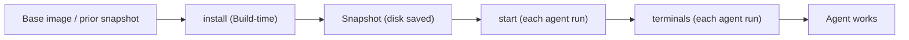

# Cloud Agent Environment

This repo is configured so Cursor Cloud Agents boot into a ready-to-use Pirate
Radio dev stack (Postgres + a local OIDC issuer + a seeded reader) and can run
the app end to end. This document explains the moving parts at a high level: the
dashboard settings a human sets once, the core concepts, the repo files that
define the environment, and **when each phase applies**.

It intentionally does not document the service-specific startup scripts; see
`scripts/dev/` and `AGENTS.md` for those details.

## 1. Cursor Cloud dashboard settings (set once; not stored in the repo)

These live in the Cloud Agents dashboard (for this team:
<https://cursor.com/t/cursor-field-eng-adm/cloud-agents>) and persist there
across runs. They are **not** part of `.cursor/environment.json` — network
policy and secrets are dashboard-managed only.

### Network Access

Under **Network Access Settings** ("Control which network destinations your
cloud agents can access"), the mode was set to **Team + My Allowlist** (the
"Default + allowlist" mode, combining the team allowlist with your personal
allowlist). These domains were added to the **Network Allowlist** so the app can
pull real article data and hero images:

```
piratewires.substack.com
www.hyperdimensional.co
hyperdimensional.co
substackcdn.com
*.substackcdn.com
```

`docker build` additionally needs the Microsoft container registry **and** the
blob CDN it redirects to. `mcr.microsoft.com` alone is not sufficient — the
manifest resolves but every layer download fails:

```
mcr.microsoft.com
*.data.mcr.microsoft.com
```

The allowlist is enforced at **VM boot**, so changes take effect on the next
freshly-booted agent (not a run already in progress).

### Secrets

`OPENAI_API_KEY` was added as a **personal (user) secret**. It powers on-demand
TTS conversions in the running app and the optional real-data harvest, and is
**not** required for the committed seed (audio is baked into the repo). User
secrets are injected at **agent start** and are **not** available during a Build.

## 2. Core concepts

| Concept | What it is | Lifetime |
| --- | --- | --- |
| **Environment** | The *definition* of the machine: which repos to clone, the base image/snapshot to start from, the `install` / `start` / `terminals` commands, plus dashboard-managed secrets and network policy. A recipe, not a running machine. | Durable; versioned as `.cursor/environment.json` or saved in the dashboard. |
| **Snapshot** | The built disk image produced when a **Build** runs the environment's `install` on top of the base. New agents boot from it, skipping re-clone/re-install. | Persists across runs; rebuilt by a new Build; ~90-day inactivity retention. |
| **Agent** | A single run working one task. It boots a fresh, isolated VM from the active snapshot, runs `start` then `terminals`, then does the work. | Transient — one VM per run. |
| **Runtime** | The live state of that VM while the agent works: processes started by `start` / `terminals`, user secrets injected at start, and the enforced network egress. | Ephemeral — **not** saved back into the snapshot. |

Relationship: **Environment** (definition) → *Build* → **Snapshot** (disk) →
*agent run boots it* → **Runtime** (live VM). Only the snapshot persists between
runs; runtime state does not.

## 3. Repo files that define the environment

| Path | Role |
| --- | --- |
| `.cursor/environment.json` | Config-as-code for the environment: the `install` / `start` / `terminals` phases and the base. |
| `scripts/dev/*` | The commands the phases invoke (Postgres, OIDC, seed, serve, harvest). |
| `scripts/dev/seed-assets/*` | Pre-generated audio + images + metadata used to seed the reader with no runtime cost. |

**Precedence / resolution order** (first match wins): repo
`.cursor/environment.json` → personal saved environment → team saved
environment. Because this repo commits `.cursor/environment.json`, that config
is what runs, overriding any dashboard-saved environment for this repo.

## 4. Lifecycle phases

The phase sequence below is the **fixed Cloud Agent lifecycle — it always
exists**. What you customize (through the environment) is the command each phase
runs. `install` runs at Build time; `start` and `terminals` run on every agent
boot and are **optional** (many repos define only `install`).



| Phase | When it runs | Optional? | Secrets available |
| --- | --- | --- | --- |
| Base | VM boots from the active snapshot (or just-in-time if none exists) | Always present | — |
| `install` | During a **Build** — triggered on save, schedule, manual, or agent request; result is snapshotted | Command optional; phase always exists | Team + environment secrets; **not** user secrets |
| Snapshot | End of a successful Build | Always | — |
| `start` | At the **start of each agent run**, on top of the snapshot | Optional | User + team/environment secrets |
| `terminals` | Right after `start`, in a shared tmux session | Optional | Same as `start` |

Cross-cutting:

- **Snapshots persist disk only.** Runtime state — running processes, exported
  env vars, in-memory caches — does **not** carry into the next run, which is
  why services belong in `start`/`terminals`, not `install`.
- **Network allowlist** is enforced at VM boot and applies to both the Build and
  the agent run; newly added domains apply on the next fresh boot.
- **Secret timing:** Build-time `install` sees team/environment secrets but not
  user secrets; user secrets are available from `start` onward.
- **Saving the environment config or changing its secrets triggers a new Build.**

## 5. How this maps to seeded / real data

- Committed `scripts/dev/seed-assets/` gives deterministic, cost-free seeding on
  every run (no OpenAI call at runtime).
- To refresh with real articles: on a freshly-booted agent (feed domains now
  allowlisted) run `node scripts/dev/harvest.mjs` to regenerate the fixtures
  from live RSS, then commit them.
- Authenticated sources (Pirate Wires paywall, X) stay limited without
  credentials — see `.cursor/rules/authenticated-sources.mdc`.

## 6. Logging in from your local machine (port forwarding)

Cursor Desktop auto-forwards a running cloud agent's ports to your machine, so
you can open the app locally at `http://localhost:8123`. OAuth here is
sensitive to the **origin** you use:

- The transaction cookie (`pirate_radio_oidc`) is `Secure` and host-only. It is
  set by `/auth/login` on the origin your browser used and must come back on
  `/auth/callback`, whose origin is derived from `PIRATE_RADIO_PUBLIC_URL`. If
  those hosts differ — e.g. you open `http://localhost:8123` but the callback
  points at `http://127.0.0.1:8123` — the cookie isn't sent and you get
  `{"error":"invalid_oidc_callback"}`. `localhost` and `127.0.0.1` are different
  cookie origins even though both resolve to loopback.
- The browser must also reach the issuer (`PIRATE_RADIO_OIDC_ISSUER`) to
  complete the authorize step, so that port must be forwarded too.

To make the forwarded flow work out of the box, the dev stack now defaults its
browser-facing host to **`localhost`** (`PIRATE_RADIO_DEV_HOST` in `env.sh`), so
`PIRATE_RADIO_PUBLIC_URL=http://localhost:8123` and
`PIRATE_RADIO_OIDC_ISSUER=https://localhost:9443` — matching the origin Cursor
forwards. Then:

1. Open the app at `http://localhost:8123` (the `localhost` hostname, not
   `127.0.0.1`).
2. Ensure both `8123` and `9443` are forwarded (Cursor forwards listening ports
   automatically) and accept the issuer's self-signed cert once (untrusted CA;
   the VM side already trusts it via `NODE_TLS_REJECT_UNAUTHORIZED=0`).

If your setup exposes a different host/port, override `PIRATE_RADIO_DEV_HOST`
(or `PIRATE_RADIO_PUBLIC_URL` + `PIRATE_RADIO_OIDC_ISSUER`) so every origin the
browser touches is identical — just don't mix `localhost` and `127.0.0.1`.

Simplest alternative: log in from the browser **inside the VM** — same origin,
no forwarding needed.

Heavier alternative: point `PIRATE_RADIO_OIDC_ISSUER` / `_CLIENT_ID` /
`_CLIENT_SECRET` at your real Authentik and register the forwarded app's
`/auth/callback` as a redirect URI. That removes the self-signed local issuer
entirely.

### Testing the login flow

For a browser check, log in inside the VM or via the forwarded
`http://localhost:8123`. The auth unit/integration logic is also covered by
`npm test` (point `PIRATE_RADIO_TEST_DATABASE_URL` at a database separate from
the dev `DATABASE_URL`, since the integration suite truncates tables).
