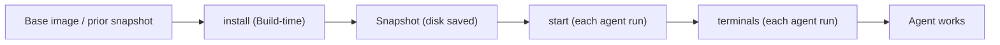

# Cloud Agent Environment

This repo is configured so Cursor Cloud Agents boot into a ready-to-use Pirate
Radio dev stack (Postgres + a local OIDC issuer + a seeded reader) and can run
the app end to end. This document explains the moving parts at a high level: the
dashboard settings a human sets once, the repo files that define the
environment, and **when each piece applies** during the cloud agent lifecycle.

It intentionally does not document the service-specific startup scripts; see
`scripts/dev/` and `AGENTS.md` for those details.

## 1. Cursor Cloud dashboard settings (set once; not stored in the repo)

These live in the Cloud Agents dashboard (for this team:
<https://cursor.com/t/cursor-field-eng-adm/cloud-agents>) and persist there
across runs. They are **not** part of `.cursor/environment.json` — network
policy and secrets are dashboard-managed only.

### Network Access

Under **Network Access Settings** ("Control which network destinations your
cloud agents can access"), the mode was set to **Team + My Allowlist** (the
"Default + allowlist" mode, combining the team allowlist with your personal
allowlist). The following domains were added to the **Network Allowlist** so the
app can pull real article data and hero images:

```
piratewires.substack.com
www.hyperdimensional.co
hyperdimensional.co
substackcdn.com
*.substackcdn.com
```

The allowlist is enforced at **VM boot**, so changes take effect on the next
freshly-booted agent (not a run that is already in progress).

### Secrets

`OPENAI_API_KEY` was added as a **personal (user) secret**. It powers on-demand
TTS conversions in the running app and the optional real-data harvest. It is
**not** required for the committed seed (audio is baked into the repo). Key
detail: user secrets are injected at **agent start** and are **not** available
during a Build.

## 2. Repo files that define the environment

| Path | What it is | Persistence |
| --- | --- | --- |
| `.cursor/environment.json` | Config-as-code for the environment: the `install` / `start` / `terminals` phases. | Versioned in git. A repo `.cursor/environment.json` takes precedence over any personal or team saved environment. |
| `.cursor/rules/*.mdc` | Scoped Cursor rules (guidance/context), auto-attached to matching files via `globs`. | Versioned. Applied while an agent edits matching files (cloud or local). Not part of the build lifecycle and never gates a run. |
| `AGENTS.md` | Durable instructions every agent reads. | Versioned. |
| `scripts/dev/*` | The commands the phases invoke (Postgres, OIDC, seed, serve, harvest). | Versioned; present in every checkout and snapshot. |
| `scripts/dev/seed-assets/*` | Pre-generated audio + images + metadata used to seed the reader with no runtime cost. | Versioned; part of every checkout and snapshot. |

**Environment resolution order** (first match wins): repo
`.cursor/environment.json` → personal saved environment → team saved
environment. Because this repo commits `.cursor/environment.json`, that config
is what runs.

## 3. Lifecycle — when each phase applies



| Phase | When it runs | Purpose | Secrets available |
| --- | --- | --- | --- |
| Base | VM boots from the active Build snapshot (or just-in-time if none exists) | Starting disk image | — |
| `install` | During a **Build** — triggered on save, on schedule, manually, or at an agent's request; the result is snapshotted | Idempotent dependency/setup work prepared ahead of time (deps, compile, warm caches) | Team + environment (Build) secrets; **not** user secrets |
| Snapshot | End of a successful Build | Saves disk state and becomes the base new agents boot from | — |
| `start` | At the **start of each agent run**, on top of the snapshot | Per-run service startup and one-time setup | User + team/environment secrets |
| `terminals` | Right after `start`, in a shared tmux session | Long-lived app processes visible to you and the agent | Same as `start` |

Cross-cutting concepts:

- **Snapshots persist disk only.** Running processes, exported env vars, and
  in-memory caches do **not** carry into an agent run — which is why services
  belong in `start`/`terminals`, not `install`.
- **Network allowlist** is enforced at VM boot and applies to both the Build and
  the agent run; newly added domains apply on the next fresh boot.
- **Secrets timing:** Build-time work (`install`) can use team/environment
  secrets but not user secrets; user secrets are available from `start` onward.
- **Rules + `AGENTS.md`** are context the agent reads while working. They are not
  a lifecycle phase and never block, decline, or kill a run.
- **Saving the environment config or changing its secrets triggers a new Build.**

## 4. How this maps to seeded / real data

- Committed `scripts/dev/seed-assets/` gives deterministic, cost-free seeding on
  every run (no OpenAI call at runtime).
- To refresh with real articles: on a freshly-booted agent (feed domains now
  allowlisted) run `node scripts/dev/harvest.mjs` to regenerate the fixtures
  from live RSS, then commit them.
- Authenticated sources (Pirate Wires paywall, X) stay limited without
  credentials — see `.cursor/rules/authenticated-sources.mdc`.
